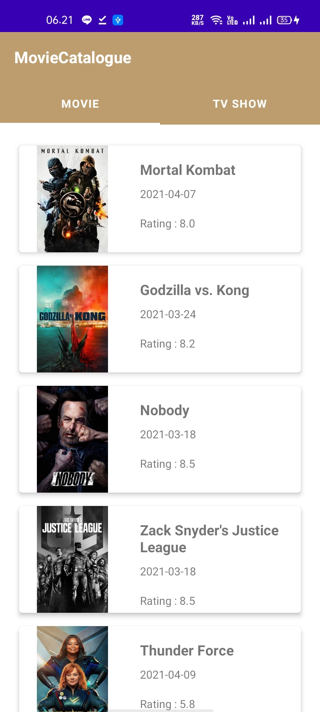

# MovieCatalogue Submission 2
### Belajar Android Jetpack Pro dari Dicoding

Aplikasi Movie Catalogue merupakan submission dari kelas Belajar Android Jetpack Pro dari dicoding, dan ini untuk memenuhi submission 2.

### Project ini menerapkan Architecture Component, Repository & LiveData
- ViewModel
- RecyclerView
- Detail
- Unit Test
- Instrumental Test
- Repository Pattern
- Live Data
- Idling

## Logo

## Preview App

